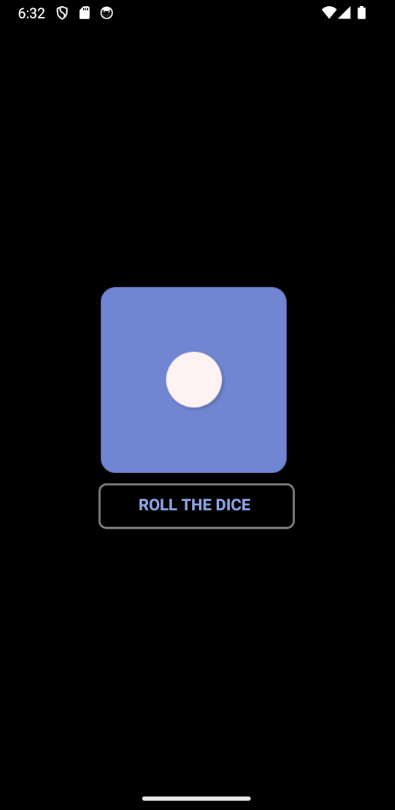
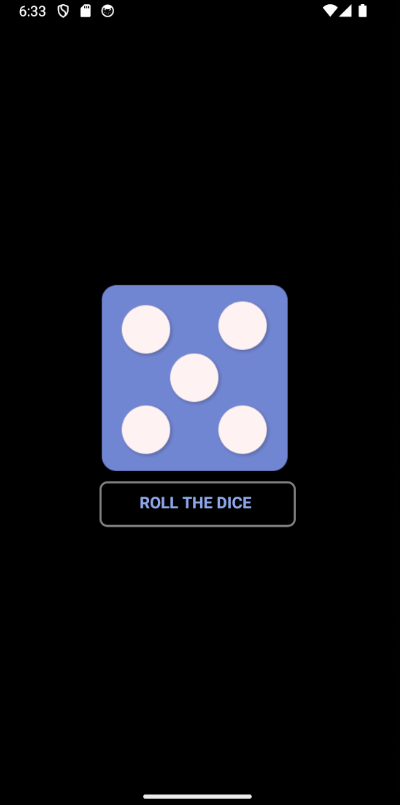

# Dice Roller App

## Overview
The Dice Roller app is a simple mobile application developed using React Native. It simulates the rolling of a dice by displaying a random dice image each time a button is pressed. The app provides a fun way to experience the excitement of rolling dice virtually.

## Features
- Roll the dice by pressing a button
- Displays a random dice image each time the button is pressed
- Provides haptic feedback upon rolling the dice for enhanced user experience

## Learning
Through the development of this app, I gained experience in:
- Working with React Native to build mobile applications
- Managing component state using the useState hook
- Implementing touchable elements for user interaction
- Displaying images using the Image component
- Integrating third-party libraries for additional features, such as haptic feedback

## Preview

## Author
This app is developed by Vishal Pandey.
